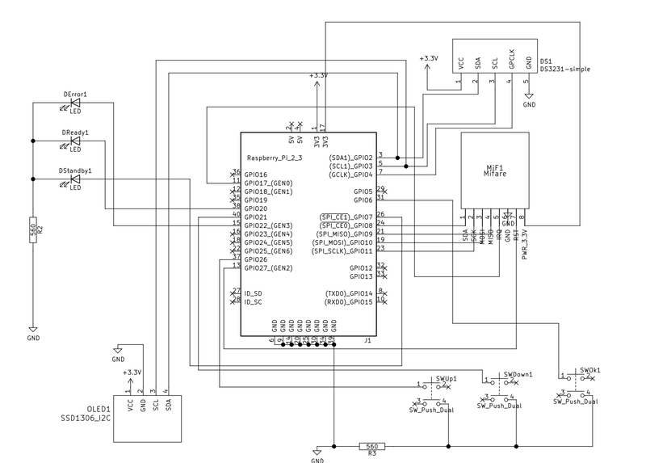

# DIY Hardware Password Keeper

## Contributors
* [Eugene](https://github.com/jdevelop)
* [Maxim](https://github.com/maximcamario)

## Objective
The goal of the project is to create the easy to build and use device that allows to store virtually unlimited number of passwords on AES encrypted storage. The storage is encrypted with AES and uses the password that is stored on the RFID FOB key.

The project consists of

* hardware
    * the device itself  
        
    * RFID key  
        
* software
    * firmware
        * services
        * util
    * web interface

## Hardware
Hardware part is built on [Raspberry Pi Zero](https://www.raspberrypi.org/products/raspberry-pi-zero/) ([W](https://www.raspberrypi.org/products/raspberry-pi-zero-w/) - optional). 

### Bill of material

* [Raspberry Pi Zero](https://www.raspberrypi.org/products/raspberry-pi-zero/) ([W](https://www.raspberrypi.org/products/raspberry-pi-zero-w/) - optional)
* [OLED Display - 0.96" I2C IIC SPI Serial 128X64 OLED LCD Display SSD1306 for 51 STM32 Arduino](https://www.ebay.com/itm/0-96-I2C-IIC-SPI-Serial-128X64-OLED-LCD-Display-SSD1306-for-51-STM32-Arduino-/201688735605)
*  [MFRC-522 RC522 RFID Radiofrequency IC Card Inducing Sensor Reader for Arduino M5](https://www.ebay.com/itm/MFRC-522-RC522-RFID-Radiofrequency-IC-Card-Inducing-Sensor-Reader-for-Arduino-M5-/301723476083)
* [Momentary Panel PCB Tactile Tact Push Button Switch 4Pin 6x6x4.5mm TS](https://www.ebay.com/itm/100Pcs-Momentary-Panel-PCB-Tactile-Tact-Push-Button-Switch-4Pin-6x6x4-5mm-TS-/172040053810?hash=item280e62e432)
* [3mm LED Light White Yellow Red Green Assortment Kit for Arduino](https://www.ebay.com/itm/3mm-5mm-Assortment-LED-Diodes-Light-Emitting-Kit-Red-Green-Blue-Yellow-White-/153414025406)
* [0.8mm 63/37 Tin Lead Rosin Core Solder Flux Soldering Welding Iron Wire Reel 14m](https://www.ebay.com/itm/0-8mm-63-37-Tin-Lead-Rosin-Core-Solder-Flux-Soldering-Welding-Iron-Wire-Reel-14m-/172519124561)
* [AWG30 wrapping wire](https://www.ebay.com/itm/AWG30-Insulated-Wire-Wrapping-Wires-Reel-250M-White-P-N-B-30-1000-K4F8/263834804615)
* [4 x M2x12 bolts/nuts](https://www.ebay.com/itm/480pcs-M2-M3-M4-Metric-Hex-Socket-Head-Cap-Screw-Bolts-Nuts-Assorted-Box-Kit-Set-/152695878844)
* Soldering iron

### Wiring schema

  

[large version](images/schema.png)

The wiring is pretty simple, just make sure you have **at least 2 inches ( 5 cm ) of wire** between components, so you won't have hard time trying to fit them into the case.

### Case

The case can be 3D printed using any PLA filament. The STL models are provided in the [/case/stl/](/case/stl/) folder. Having layers height of 0.15 mm should work, some may try 0.20 for quick print or go thinner for smoother surfaces. 


## Firmware

The OS is based on [Linux Kernel 4.14](https://github.com/torvalds/linux/commit/865ddc1393f558198e7e7ce70928ff2e49c4f7f6) for Raspberry Pi. 

The application is written in [Golang](https://golang.org/) with heavy use of [https://periph.io/](https://periph.io/) components for MFRC522 and OLED display.

### Building

#### Requirements

* [GNU Make](https://www.gnu.org/software/make/)
* [Docker](https://www.docker.com/)
* [buildroot](https://buildroot.org/downloads/buildroot-2018.08.2.tar.gz) version 2018.08.2 ( newer versions might work too )

#### Instructions

The application consists of 2 components:

* firmware 
    * service
    * oled splash
* web interface ( AngularJS )

These components can be build separately:

* `make web` - builds the web interface.
    The application embeds the WEB interface into itself, hence `make web` has to be invoked first, in order to produce all necessary artifacts.
* `make firmware` - builds services
* `make all` - builds the web interface and services
* `make linux` - builds the linux image to write on a micro SD card for Raspberry Pi. Requires path to buildrood to be set in `BUILDROOT` variable.


```
make all linux BUILDROOT=%PATH/TO/BUILDROOT/HERE%
``` 
will build the web interface, services and will invoke buildroot to produce the disk image in `buildroot/images/sdcard.img` file. This file can be written onto a micro SD card with 
```
dd if=buildroot/images/sdcard.img of=/dev/sda bs=1M
```

# Usage

Once the device is assembled, you will need to plug it into the USB port of your computer/laptop. 

When you'll see the prompt on OLED display ( and yellow LED will be lit )- insert the FOB into the device to unlock the encrypted internal storage.

**Make sure that you use proper data cable - not just charging cable!**. The cable has to be inserted into the **data** port on the device itself, otherwise the device won't be able to communicate with the computer properly.

 

The device will register itself as a network interface in the computer/laptop and will be accessible at **[http://10.101.1.1](http://10.101.1.1)**

### Add/update password
Initially there will be no passwords ( for some reason we called them seeds ) configure, so you will be able to add your own:


### View passwords / dashboard

The dashboard shows the list of the passwords stored in the device:


# Roadmap

## Software / UI 
* Add backup/restore options for the password storage
* Add password generation
* Add more keys to the same device that will unlock partial storage, so it will be possible to share the device between users.

## Hardware
* Improve the design of the case, make it more ergonomic.
* Design [PCB](https://en.wikipedia.org/wiki/Printed_circuit_board) for easy assembling.

# Contact

Please feel free to [contact us](https://forms.gle/r6L1QsXPWsKD5iBB6) if you'd get any questions or comments.

# Project updates

If you want to keep in touch and get some news / updates / new feature announcements - please [subscribe here](https://forms.gle/FqkYDQtQowCpkGfk6). **We are not going to share your e-mail address anywhere with anyone**
